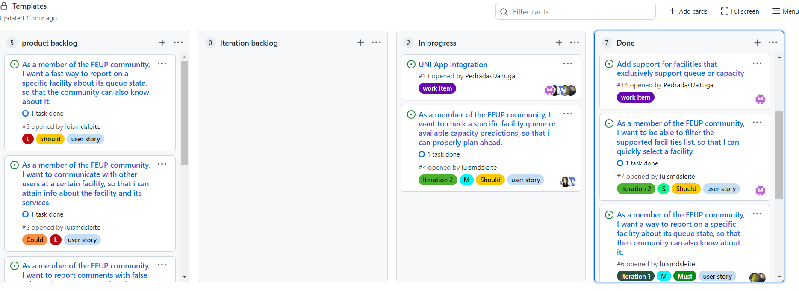

## Project management

Below, you can find information, plans, and retrospective about our project on the context of ESOF. This is still an ongoing project and may suffer some changes

## Release 1.0
* Release management: [Release 1.0](https://github.com/LEIC-ES-2021-22/2LEIC15T2/releases/tag/v1.0)

## Release 1.1
* Backlog management: Product backlog and Iteration backlog in a [Github Projects board](https://github.com/LEIC-ES-2021-22/templates/projects/1);
* Release management: [Release 1.1](https://github.com/LEIC-ES-2021-22/2LEIC15T2/releases/tag/v1.1)
* Iteration planning and retrospectives: 
  * Final Board
  * Example:
 

  

 
  * Retrospectives: 
     * Did well:  
           Work items planning 
           Good Communication 
           Work consistency 
           Fast development in the user GUI app  
           
     * Do Differently: 
           Bad assigning to user stories (1 person can´t be in 2+ user stories at the same time) 
           Assign 2 people to focus on tests implementation  
        
         
     * Puzzles:  
           Task assigning to iteration backlog  
           Choosing the right tags to each work item 
           Flutter programming (we are still newbies!)  
           Gherkin Tests 
           
## Release 1.2

* Release management: [Release 1.2](https://github.com/LEIC-ES-2021-22/2LEIC15T2/releases/tag/v1.2);
* Iteration planning and retrospectives: 
  * Initial Board:
 

  

  * Final Board:
 

  

 * Retrospectives: 
 
     * Did well:  
           Gherkin Tests 
           Good communication among the team maintained  
           Dart programming is becoming more intuitive  
           
           
     * Do Differently: 
          Unit testing - Some tests could be implemented in easier ways   
        
         
     * Puzzles:  
           Dificulty of user stories - some where underestimated 
           Integration of tests with the UNI app 
           
           
           
## Final Release 

* Release management: [Final Release](https://github.com/LEIC-ES-2021-22/2LEIC15T2/releases/tag/FinalRelease);

* Iteration planning and retrospectives: 
  * Initial Board:
 

  

  * Final Board:
 

  

 * Retrospectives: 
 
     * Did well:  
           Finished Gherkin Tests and Unit Tests 
           Good communication among the team maintained  
           Dart programming is becoming more intuitive  
           
           
     * Do Differently: 
          
        
         
     * Puzzles:  
           Integration of tests with the UNI app 
           We were unable to optimize the GPS Location due to some bugs while interacting with the UNI app.  
           
           
           
