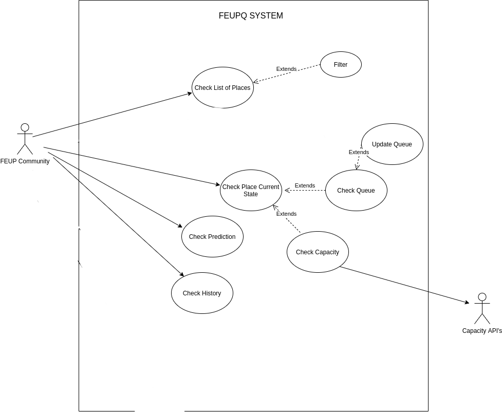

## Requirements

In this section, you should describe all kinds of requirements for your module: functional and non-functional requirements.

### Use case model 

Example:
 

  

|||
| --- | --- |
| *Name* | Check List of Places |
| *Actor* |  Uni app User | 
| *Description* | The user can check all avaliable places |
| *Preconditions* | - The user is logged in UniFEUP.  |
| *Postconditions* | - The selected queue will be displayed    |
| *Normal flow* | 1. The community acesses the system, by using FEUP's sigarra credentials.  2. The system displays a list of supported places  |
| *Alternative flows and exceptions* | 1. [Filter] After step 2 the user can optionally choose to apply a filter to the results shown |

|||
| --- | --- |
| *Name* | Check Place Current State |
| *Actor* |  Uni app User | 
| *Description* | Shows the selected place queue and capacity |
| *Preconditions* | - The User has a place selected.  |
| *Postconditions* | - Nothing (only displays capacity)    |
| *Normal flow* | 1. The user acesses the system, by using FEUP's sigarra credentials.  2. The system displays a list of places  3. The User selects a place.  4 The system shows the selected place capacity and queue status |
| *Alternative flows and exceptions* | 1. [No Capacity] If, in step 4 of the normal flow, the capacity feature is not support then it will not be displayed.   2. [No Queue] If, in step 4 of the normal flow, the queue feature is not support then it will not be displayed.|

### User stories
This section will contain the requirements of the product described as **user stories**. 

A user story is a description of desired functionality told from the perspective of the user or customer. A starting template for the description of a user story is 

*As a < user role >, I want < goal > so that < reason >.*

User stories should be created and described as [Issues](https://github.com/LEIC-ES-2021-22/templates/issues) in GitHub with the label "user story". See how to in the video [Creating a Product Backlog of User Stories for Agile Development using GitHub](https://www.youtube.com/watch?v=m8ZxTHSKSKE).

You should give a very short name to the issue and, in the "comments" field, add the user story itself (see above), the image(s) of the user interface mockup(s) (see below) and the acceptance test scenarios (see below). 

**INVEST in good user stories**. 
You may add more details after, but the shorter and complete, the better. In order to decide if the user story is good, please follow the [INVEST guidelines](https://xp123.com/articles/invest-in-good-stories-and-smart-tasks/).

**User interface mockups**.
After the user story text, you should add a draft of the corresponding user interfaces, a simple mockup or draft, if applicable.

**Acceptance tests**.
For each user story you should write also the acceptance tests (textually in [Gherkin](https://cucumber.io/docs/gherkin/reference/)), i.e., a description of scenarios (situations) that will help to confirm that the system satisfies the requirements addressed by the user story.

**Value and effort**.
At the end, it is good to add a rough indication of the value of the user story to the customers (e.g. [MoSCoW](https://en.wikipedia.org/wiki/MoSCoW_method) method) and the team should add an estimation of the effort to implement it, for example, using t-shirt sizes (XS, S, M, L, XL).

### Domain model

To better understand the context of the software system, it is very useful to have a simple UML class diagram with all the key concepts (names, attributes) and relationships involved of the problem domain addressed by your module. 
Also provide a short textual description of each class. 

Example:
 

  

